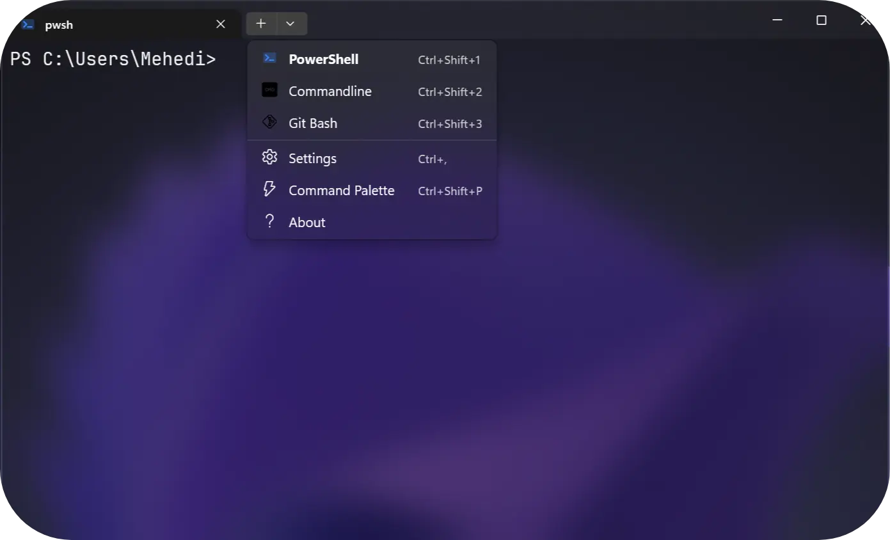

# Windows Terminal Customization

<p align="center"><a href="https://github.com/devbytemehedi/windows_terminal_customization"></a></p>

## Installation
* Install or Update [Windows Terminal](https://github.com/microsoft/terminal.git)
```bash
winget install -e --id Microsoft.WindowsTerminal
```
* Install Nerd Font : [JetBrainsMono Nerd Font Mono](https://github.com/devbytemehedi/JetBrainsMono.git)
* Clone this repo
```bash
git clone https://github.com/devbytemehedi/windows_terminal_customization.git
```
* place your [settings.json](./settings.json) file in this location:
```bash
%LOCALAPPDATA%\Packages\Microsoft.WindowsTerminal_8wekyb3d8bbwe\LocalState
```
* place the `WT-ICONS` folder in this location
```bash
%userprofile%
```
* to customize prompt follow this [link](https://github.com/devbytemehedi/starship_customization)
